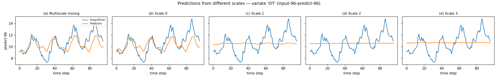
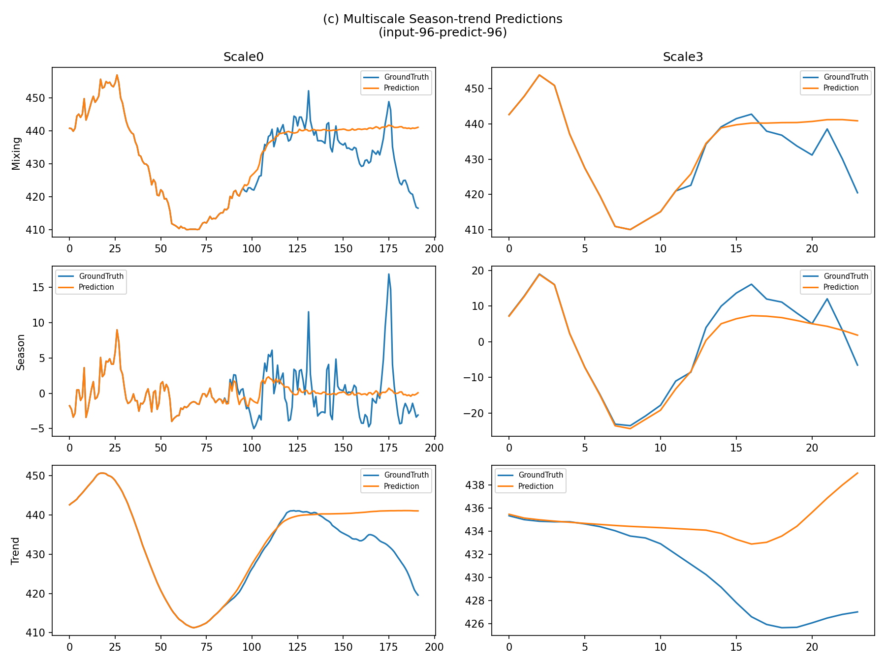

# TimeMixer: A From-Scratch Reproduction

A PyTorch reimplementation of **TimeMixer: Decomposable Multiscale Mixing for Time Series Forecasting** (Wang et al., ICLR 2024), and benchmarked against a DLinear baseline on two datasets.

[Paper](https://arxiv.org/abs/2405.14616) 
## What this is

TimeMixer forecasts time series by decomposing the input into multiple temporal scales (via average pooling) and mixing seasonal/trend components across those scales in opposite directions — seasonal information flows bottom-up (fine → coarse) and trend information flows top-down (coarse → fine). Multiple per-scale predictors are then ensembled to produce the final forecast.

This repo implements the full architecture — `MultiscaleDownsampling`, `SeriesDecomp`, `MultiScaleSeasonMixing`, `MultiScaleTrendMixing`, `PastDecomposableMixing`, `FutureMultipredictorMixing` — each module mapped directly to the paper's Eq. 1–6, plus a channel-independence mode, per-scale RevIN-style normalization, and a convolutional token embedding, matching the official repo's design choices for the ETT/Weather benchmarks.

## Results

Trained on **ETTh1** and **Weather**, evaluated at all four standard horizons (96/192/336/720), compared against the paper's reported numbers and a from-scratch DLinear baseline trained identically.

### ETTh1

| pred_len | TimeMixer (mine) | TimeMixer (paper) | DLinear (mine) |
|---|---|---|---|
| 96  | 0.3774 / 0.3947 | 0.375 / 0.400 | 0.3823 / 0.3940 |
| 192 | 0.4278 / 0.4312 | 0.429 / 0.421 | 0.4557 / 0.4518 |
| 336 | 0.4695 / 0.4453 | 0.484 / 0.458 | 0.4775 / 0.4537 |
| 720 | 0.5402 / 0.5079 | 0.498 / 0.482 | 0.5308 / 0.5210 |
| **Avg** | **0.4537 / 0.4448** | **0.447 / 0.440** | **0.4616 / 0.4551** |

*(format: MSE / MAE, lower is better)*

TimeMixer beats DLinear on 3 of 4 horizons (all except 720) and on average, by ~1.7% MSE and ~2.3% MAE, while landing within ~1.5% of the paper's average MSE.

### Weather

| pred_len | TimeMixer (mine) | TimeMixer (paper) | DLinear (mine) |
|---|---|---|---|
| 96  | 0.1623 / 0.2088 | 0.163 / 0.209 | 0.1945 / 0.2553 |
| 192 | 0.2068 / 0.2500 | 0.208 / 0.250 | 0.2358 / 0.2939 |
| 336 | 0.2628 / 0.2906 | 0.251 / 0.287 | 0.2819 / 0.3317 |
| 720 | 0.3421 / 0.3427 | 0.339 / 0.341 | 0.3468 / 0.3843 |
| **Avg** | **0.2435 / 0.2730** | **0.240 / 0.271** | **0.2647 / 0.3163** |

On Weather, my TimeMixer reproduction is within ~1.5% of the paper's numbers on average — essentially a match. It also clearly outperforms DLinear here (~8% lower MSE, ~13.7% lower MAE), consistent with the paper's own finding that TimeMixer's advantage over simple linear baselines widens on datasets with more variates and more training data.

### Sample forecasts




## What I actually built vs. what's borrowed

To be upfront about scope:

- **Faithful to the paper**: all six core equations (multiscale downsampling, embedding, series decomposition, bottom-up seasonal mixing, top-down trend mixing, multi-predictor ensemble) are implemented from the equations in Sections 3.1–3.3, not copied from the official repo.
- **Borrowed design choices, not spelled out in the equations**:
  - *Channel-independence mode* — treating each variate as an independent sample during mixing. Matches the official repo's default for ETT/Weather; I added this after debugging severe overfitting (see below).
  - *Convolutional token embedding* — the official repo embeds each scale with a `Conv1d(kernel_size=3, padding_mode='circular')` rather than a plain per-timestep linear layer, letting embedded timesteps borrow local context from neighbors. I adopted this after noticing coarse-scale predictors (which see as few as 12 input timesteps) were collapsing to near-flat outputs with a plain linear embedding.
- **Not implemented**: imputation, classification, and anomaly-detection heads, short-term forecasting (M4/PEMS) configs, and the DFT-based decomposition variant explored in the paper's Appendix F.2 — this reproduction is scoped to long-term forecasting only.


## Repo structure

```
README.md
LICENSE
data/
├── .gitkeep
├── ETTh1.csv
└── weather.csv
functions/
├── __init__.py
├── baseline_dlinear.py        
└── run_multi_dataset.py       
model/
├── .gitkeep
└── timemixer.py                # core TimeMixer architecture
Results/
├── .gitkeep
├── multiscale_timemixer_weather_prediction.png
└── scalepred_timemixer_etth1_prediction.png  
```

## Reproducing

```bash
# clone the repo
git clone https://github.com/oyshie402/Timemixer.git
cd Timemixer

# install dependencies
pip install -r requirements.txt

# train on ETTh1
python functions/run_multi_dataset.py --dataset ETTh1 --data_path data/ETTh1.csv

# train on Weather
python functions/run_multi_dataset.py --dataset weather --data_path data/weather.csv

# outputs (loss curves, forecasts, multiscale + per-scale predictions)
# are saved to Results/
```

## Reference

```bibtex
@inproceedings{wang2024timemixer,
  title={TimeMixer: Decomposable Multiscale Mixing for Time Series Forecasting},
  author={Wang, Shiyu and Wu, Haixu and Shi, Xiaoming and Hu, Tengge and Luo, Huakun and Ma, Lintao and Zhang, James Y and Zhou, Jun},
  booktitle={International Conference on Learning Representations},
  year={2024}
}
```
